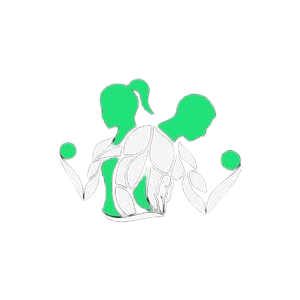

# FitTrack



Welcome to FitTrack, your ultimate fitness companion, designed to help you track and manage your health and fitness journey with ease.

## About

Whether you're aiming to lose weight, build muscle, or simply maintain a healthy lifestyle, FitTrack provides you with the tools and insights you need to achieve your goals.

## Key Features

- **Track Physical Measurements:** Monitor weight, height, and body fat percentage to stay on top of your progress.
- **Progress Photos:** Capture your transformation visually by uploading progress photos and see your journey unfold.
- **Log Exercise and Nutrition:** Keep a detailed record of your workouts, meals, and overall well-being to optimize your fitness regimen.
- **Customizable Categories:** Personalize your tracking experience by customizing categories and tags to suit your individual preferences and goals.
- **Real-time Feedback:** Stay motivated and on track with real-time feedback and motivational messages tailored to your progress.

## Why FitTrack?

Taking control of your fitness has never been easier. FitTrack empowers users worldwide to transform their lives with its intuitive interface and powerful tracking capabilities.

## Get Started

Get started today and embark on your journey to a healthier, happier you with FitTrack!

## Installation

To get started with FitTrack, follow these simple steps:

1. Clone the repository:
   ```
   git clone https://github.com/omprxz/fittrack.git
   ```

2. Install dependencies:
   ```
   npm install
   ```

3. Start the application:
   ```
   npm start
   ```

## Support

For any inquiries or assistance, please contact our support team at omprxz@gmail.com.
